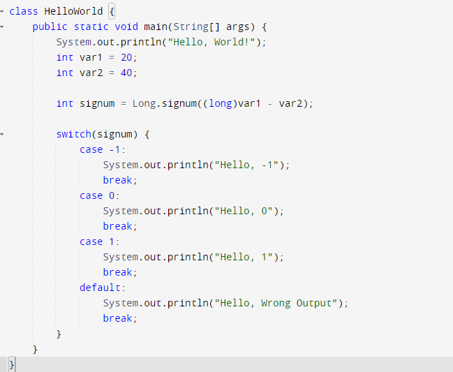

**1) enum Kullanımı**

enum = enumerations ifadesinin kısa halidir.\
Anlam olarak da "özel olarak listelenmiş" ifadesine karşılık gelen "numaralandırmalar"ın kısa halidir.

Daha öncesinde tanımladığımı sabit değerleri ifade etmek için kullanılır.
Aslında bir sabit ifadeleri temsil eden özel bir sınıf çeşididir.

enum oluşturmak için tüm değişkenlerin büyük harfle hazırlanması gerektiği unutulmamalıdır.

Enum bir sınıf gibi özelliklere ve metotlara sahip olabilir ancak enum'daki sabitler public, statik biçimde olduğundan dolayı değiştirilemez yapıdadır.
Enumlar değişmeyeceğini bildiğiniz değerler için kullanılır.
Ör. Araba için sunduğunuz renk çeşidi yalnızca 4 adet olabilir.

---
**2) String[] args ifadesi nedir ?**

main metoduna iletilen bir karakter dizisi anlamına gelir.

Bizim çalışmamızda kullanma sebebimiz ise, metot içinde tüm Chrome options parametrelerini tek tek tanımlamak yerine bir dizi içinde tanımladık.\
Bu sayede ileride bu diziyi genişletip istediğimiz parametreyi kullanabilir halde tuttuk.

---
3) Reflection nedir ?

Reflection kelime anlamı olarak yansıma demektir.\
Reflection, yürütülen programdaki metotlarının, sınıfların veya arayüzlerin davranışlarını incelemek veya değiştirmek için kullanılır.\

Reflection bize bir nesnenin ait olduğu sınıf ve ayrıca o sınıfın nesne kullanılarak yürütülebilecek yöntemleri hakkında bilgi verir.\
Reflection ile kullanılan erişim belirtecinden bağımsız olarak çalışma zamanında yöntemleri çağırabiliriz.

---
**4) Clean code kuralları

Java'da ve diğer programlama dillerinde kodu yazmak kadar temiz kod yazımı da önemlidir.

Bununla alakalı olarak bir kaç tane kaynak referanslar kısmında belirtilmiştir. 

Bizim çalışmamızda bahsettiğimiz ise <b> Metotlar yalnızca tek bir şey yapmalıdır. Örneğin sadece isim değerini almak gibi </b>

---
**5) Switch-case'de sayı karşılaştırmak mümkün müdür ?

Java'da switch-case yapısı kullanarak sayıları karşılaştırmak da mümkündür. 
if-else yapısı dışında bu yöntem de kullanılabilir.

Aşağıdaki örnekte iki sayının çıkartma işlemine göre elde edilen işaretin karşılatırılması bu yapı ile yapılmıştır.

---

**6) Garbage collector nedir ?
  
Garbage collector anlam olarak çöp toplayıcı demektir.

Garbage Collection, otomatik bellek yönetimi mekanizmasıdır.\
Java programları, bir Java Sanal Makinesinde veya kısaca JVM'de çalıştırılabilen bayt koduna derlenir.\
Java programları JVM üzerinde çalıştığında, programa ayrılmış belleğin bir bölümü olan öbek üzerinde nesneler oluşturulur.\ 
Programın akışı sonunda, bazı nesnelere artık ihtiyaç kalmayacaktır.\
Garbage collector, bu kullanılmayan nesneleri bulur ve belleği boşaltmak için onları siler.

---

**7) Evalute Expression

İfadenin değerlendirilmesi anlamına gelmektedir.

Java uygulamaları, değişmez değerlerin, method çağırma işlemlerini, değişken adlarının ve operatörlerin birleşimleri olan ifadeleri değerlendirerek verileri işler.\
Bir ifadeyi değerlendirmek, tipik olarak, bir değişkende saklanabilen, karar vermek için kullanılan vb. yeni bir değer üretir.

---

<b>
****************************************************************************************************************************************************
</b>

---
# References

1. [Java’da Enum Kullanımı](https://medium.com/gokhanyavas/javada-enum-kullan%C4%B1m%C4%B1-31015e8402b5)
2. [Java’da Enum Kavramı](https://emrecelen.com.tr/javada-enum-kavrami/)
3. [Java Enums](https://www.w3schools.com/java/java_enums.asp)
4. [Reflection in Java](https://www.geeksforgeeks.org/reflection-in-java/)
5. [Using Java Reflection](https://www.oracle.com/technical-resources/articles/java/javareflection.html)
6. [Java Clean Code - How to Write Clean Code in Java?](https://www.scaler.com/topics/java/java-clean-code/)
7. [Clean Coding in Java](https://www.baeldung.com/java-clean-code)
8. [Clean Code Explained – A Practical Introduction to Clean Coding for Beginners](https://www.freecodecamp.org/news/clean-coding-for-beginners/)
9. [Switch Case in Java](https://www.scaler.com/topics/java/switch-case-in-java/)
10. [Garbage Collection in Java](https://www.geeksforgeeks.org/garbage-collection-java/)
11. [JVM’i Anlamak: Garbage Collector](https://tugrulbayrak.medium.com/jvm-garbage-collector-nedir-96e76b6f6239)
12. [Evaluate String Expression Java | InFix Expression Evaluation Java](https://codedaily.in/evaluate-string-expression-java/)
13. [Evaluate Java expressions with operators](https://www.infoworld.com/article/2940467/java-101-evaluate-java-expressions-with-operators.html#:~:text=Java%20applications%20process%20data%20by,a%20decision%2C%20and%20so%20on.)
14. [Evaluate a Mathematical Expression in Java](https://www.delftstack.com/howto/java/java-evaluate-expression/)
15. [Expression Evaluation](https://www.geeksforgeeks.org/expression-evaluation/)
